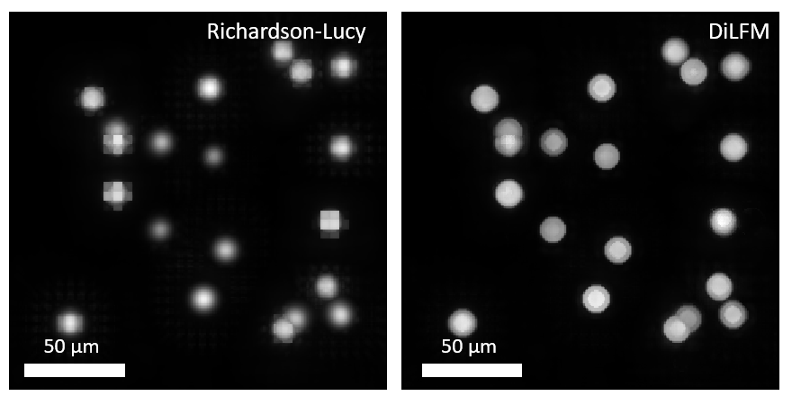
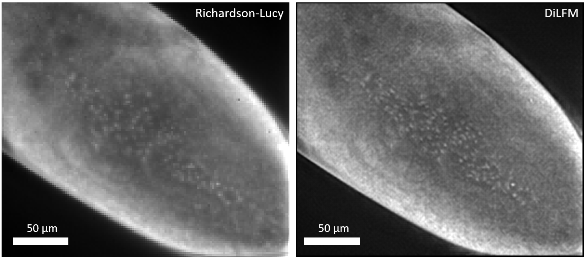

# DiLFM

Implementation for dictionary lgiht field microscope (DiLFM)

## System requirements
* Software:
  * Matlab-compatible version of Windows or Linux (see https://www.mathworks.com/support/requirements/matlab-system-requirements.html)
  * Matlab R2019b or newer
  * Toolboxes: signal processing, image processing
  * Matlab-compatible CUDA driver (for LFM deconvolution)

## Usage
### Run the DiLFM demo with virtual beads
  1. Generate /src/gen_sphere_sample.m for train and test sample generation
  2. Prepare light-field microscope PSF generation function (one example can be found in /PSF file, while this repo has already prepared a small one for you)
  3. Run demo_dictionary_LFM.m and check out_stack varaible for final output. You can comapre the results with ours in /output/bead

### Run DiLFM with embryo data
* use pretrained dictionary
  1. Collect pre-trained dictionary data in /data/Learned_dictionary_size_1500_Tdata_5_peak_7_cut_0.01_overlap_4. 
  2. Run demo_dictionary_LFM_embryo.m and check the output. You can compare the results with ours in /output/embryo.tif

* use self-trained dictionary
  1. Collect training dataset following data/train_bio_sample/README.md
  2. Collect training PSF following embryo_psf.md
  3. Run demo_dictionary_LFM_embryo.m and check the output. You can compare the results with ours in /output/embryo.tif

## Instructions
* To train your own DiLFM model
  1. Collect trainning data that is similar with your target data then put it into /data folder
     For example, https://bbbc.broadinstitute.org/ for cell imaging dataset. We proide a small training data in /data/train_bio_sample folder through Google drive.
  2. Run virtual LFM propagation and RL deconvolution to get low-resolution results (this can be done through /src/gen_RL_capture.m)
  3. Run lfm_dictionary_training.m for high- and low-resolution pair training

